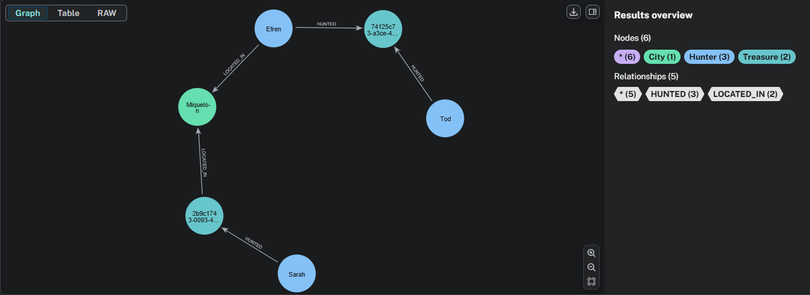

# NEO4J - Pieter Neyt
## Setup Instructions
1) NEO4J desktop installeren
2) Maak een lokale dbms instantie aan via de UI
3) Import folder aanmaken en daar alle benodigde CSV-bestanden in toevoegen voor die dbms instantie
- treasures.csv
- hunts.csv (treasure_log)
- hunters.csv
- cities.csv

``

## Date Model Design
**Graph Schema:**
- **Nodes:**
  - `Hunter` - Represents treasure hunters
    - Properties: `hunter_id`, `first_name`, `last_name`, `email`, `phone`, `address`, `country`, `experience_level`
  - `Treasure` - Represents hidden treasures
    - Properties: `treasure_id`, `difficulty`, `terrain`, `city_id`
  - `City` - Represents geographical locations
    - Properties: `city_id`, `city_name`, `latitude`, `longitude`, `country_code`

- **Relationships:**
  - `(Hunter)-[:LIVES_IN]->(City)` - Hunter resides in a city
  - `(Treasure)-[:LOCATED_IN]->(City)` - Treasure is located in a city
  - `(Hunter)-[:HUNTED]->(Treasure)` - Hunter has searched for a treasure
    - Properties: `hunt_id`, `duration_seconds`, `hunt_date`

## Database Setup Script (in neo4j cypher)
```cypher
// Clear de database
MATCH (n)
DETACH DELETE n;

// ============================================================================
// STEP 1: Constraints & Indexes  
// ============================================================================
CREATE CONSTRAINT hunter_id IF NOT EXISTS FOR (h:Hunter) REQUIRE h.hunter_id IS UNIQUE;
CREATE CONSTRAINT treasure_id IF NOT EXISTS FOR (t:Treasure) REQUIRE t.treasure_id IS UNIQUE;
CREATE CONSTRAINT city_id IF NOT EXISTS FOR (c:City) REQUIRE c.city_id IS UNIQUE;

CREATE INDEX hunter_name IF NOT EXISTS FOR (h:Hunter) ON (h.first_name, h.last_name);
CREATE INDEX city_name IF NOT EXISTS FOR (c:City) ON (c.city_name);
CREATE INDEX treasure_difficulty IF NOT EXISTS FOR (t:Treasure) ON (t.difficulty);

// STEP 2: Import CITIES
LOAD CSV WITH HEADERS FROM 'file:///cities.csv' AS row
CALL {
  WITH row
  MERGE (c:City {city_id: row.city_id})
  SET c.city_name = row.city_name,
      c.latitude = toFloat(row.latitude),
      c.longitude = toFloat(row.longitude),
      c.country_code = row.country_code
} IN TRANSACTIONS OF 1000 ROWS

// STEP 3: Import HUNTERS - FIXED FIELD NAMES
LOAD CSV WITH HEADERS FROM 'file:///hunters.csv' AS row
CALL {
  WITH row
  MERGE (h:Hunter {hunter_id: row.hunter_id})
  SET h.first_name = row.first_name,
      h.last_name = row.last_name,
      h.email = row.email,
      h.phone = row.number,
      h.address = row.street,
      h.city_id=row.city_id,
      h.country = 'Unknown',               
      h.experience_level = 'Intermediate'

} IN TRANSACTIONS OF 1000 ROWS;

// STEP 4: Import TREASURES
LOAD CSV WITH HEADERS FROM 'file:///treasures.csv' AS row
CALL {
  WITH row
  MERGE (t:Treasure {treasure_id: row.treasure_id})
  SET t.difficulty = toInteger(row.difficulty),
      t.terrain = toInteger(row.terrain),
      t.city_id = row.city_id
} IN TRANSACTIONS OF 1000 ROWS;

// STEP 5: Create Hunter -> City (LIVES_IN) - FIXED
MATCH (h:Hunter)
CALL {
  WITH h
  MATCH (c:City {city_id: h.city_id})
  MERGE (h)-[:LOCATED_IN]->(c)
} IN TRANSACTIONS OF 1000 ROWS;

// STEP 6: Create Treasure -> City (LOCATED_IN) 
MATCH (t:Treasure)
CALL {
  WITH t
  MATCH (c:City {city_id: t.city_id})
  MERGE (t)-[:LOCATED_IN]->(c)
} IN TRANSACTIONS OF 1000 ROWS;

// STEP 7: Create Hunter -> Treasure (HUNTED)
LOAD CSV WITH HEADERS FROM 'file:///hunts.csv' AS row
CALL {
  WITH row
  MATCH (h:Hunter {hunter_id: row.hunter_id})
  MATCH (t:Treasure {treasure_id: row.treasure_id})
  MERGE (h)-[r:HUNTED {hunt_id: row.hunt_id}]->(t)
  SET r.duration_seconds = toInteger(row.duration_seconds),
      r.hunt_date = datetime(replace(row.log_time, ' ', 'T'))
} IN TRANSACTIONS OF 1000 ROWS

// STEP 8: Verification Queries
MATCH (h:Hunter) RETURN count(h) AS hunter_count;
MATCH (t:Treasure) RETURN count(t) AS treasure_count;
MATCH (c:City) RETURN count(c) AS city_count;

MATCH ()-[r:HUNTED]->() RETURN count(r) AS hunts;
MATCH ()-[r:LIVES_IN]->() RETURN count(r) AS lives_in;
MATCH ()-[r:LOCATED_IN]->() RETURN count(r) AS located_in;

// Check if relationships are properly created
MATCH (h:Hunter)-[:LIVES_IN]->(c:City)
RETURN h.first_name, h.last_name, c.city_name
LIMIT 10;

MATCH (h:Hunter)-[:HUNTED]->(t:Treasure)-[:LOCATED_IN]->(c:City)
RETURN h.first_name, h.last_name, t.treasure_id, t.difficulty, c.city_name
LIMIT 10;
```
## Queries
### Query 1: Fast Hunts
```cypher
// ============================================================================
// QUERY 1: Fast Hunts
// ============================================================================
// We zijn geïnteresseerd in welke steden het populair is om 'fast hunts' te doen.
// Een 'fast hunt' is een hunt die in totaal minder dan 30 minuten (1800 seconden) duurt.
// Toon de top 10 steden op basis van het aantal 'fast hunts'.
// Toon ook hoeveel hunters er in die steden wonen.

MATCH (h:Hunter)-[r:HUNTED]->(t:Treasure)-[:LOCATED_IN]->(c:City)
WHERE r.duration_seconds < 1800   // 30 minuten = 1800 seconden
WITH c, COUNT(r) AS fast_hunts
OPTIONAL MATCH (c)<-[:LOCATED_IN]-(resident:Hunter)
WITH c, fast_hunts, COUNT(DISTINCT resident) AS resident_count
RETURN 
  c.city_name AS city,
  fast_hunts AS total_fast_hunts,
  resident_count AS total_hunters
ORDER BY total_fast_hunts DESC
LIMIT 10;
```
| city | total_fast_hunts | total_hunters |
|---|---|---|
| Citta' Del Vaticano | 1025 | 956 |
| Miquelon | 605 | 473 |
| Saint-Pierre | 584 | 475 |
| Alo | 537 | 301 |
| Uvéa | 496 | 315 |
| Sigave | 406 | 332 |
| St Helier | 357 | 235 |
| St Brelades | 297 | 238 |
| Longyearbyen | 217 | 125 |
| Alderney | 196 | 113 |

### Query 2: Fellow Hunters
```cypher
// ============================================================================
// QUERY 2: Fellow Hunters
// ============================================================================
// Welke hunters lijken het meest op elkaar omdat ze dezelfde treasures gezocht hebben?
// Geef de top 10 meest op elkaar lijkende hunters op basis van het aantal treasures 
// dat ze gezamenlijk hebben gezocht.


MATCH (h1:Hunter)
WITH h1
ORDER BY h1.hunter_id  // voor consistente resultaten
LIMIT 40000              

// Stap 2: Vind treasures die h1 heeft gezocht
MATCH (h1)-[:HUNTED]->(t:Treasure)<-[:HUNTED]-(h2:Hunter)
WHERE id(h1) < id(h2)   // voorkomt dubbele paren
WITH h1, h2, COUNT(DISTINCT t) AS shared_treasures
WHERE shared_treasures > 0

RETURN 
  h1.first_name + ' ' + h1.last_name AS hunter_1,
  h2.first_name + ' ' + h2.last_name AS hunter_2,
  shared_treasures
ORDER BY shared_treasures DESC
LIMIT 10;
```
| hunter_1 | hunter_2 | shared_treasures |
|---|---|---|
| Zackery Daniel | Erich Mueller | 9 |
| Katelin Bode | Zane Jacobi | 9 |
| Ricardo Delagarza | Ariadna Venegas | 9 |
| Zella Schuppe | Anna Borer | 8 |
| Noelia Schneider | Adella Stroman | 8 |
| Marcelino West | Rose Howe | 8 |
| Abdiel Langosh | Russel Haley | 8 |
| Consuelo Hauck | Liam Conn | 7 |
| Emilie Koch | Candice Friesen | 7 |
| Bernadine Kilback | Keara Stoltenberg | 7 |


### Query 3: Connected Cities
```cypher
// ============================================================================
// QUERY 3: Connected Cities
// ============================================================================
// Identificeer voor een stad, welke andere stad hier sterk aan gekoppeld is.
// Je doet dit door te kijken naar de inwoners; naar welke andere steden gaan 
// zij om treasures te zoeken?
// Toon de 10 steden combinaties die het sterkst aan elkaar gekoppeld zijn.

MATCH (home:City)<-[:LOCATED_IN]-(h:Hunter)-[:HUNTED]->(t:Treasure)-[:LOCATED_IN]->(target:City)
WHERE home <> target   // negeer lokale jachten
WITH home, target, COUNT(DISTINCT h) AS hunters_traveled
RETURN
  home.city_name AS from_city,
  target.city_name AS to_city,
  hunters_traveled
ORDER BY hunters_traveled DESC
LIMIT 10;

```
| from_city | to_city | hunters_traveled |
|---|---|---|
| Saint-Pierre | Miquelon | 34 |
| Miquelon | Saint-Pierre | 28 |
| Alo | Uvéa | 26 |
| Uvéa | Alo | 19 |
| Uvéa | Sigave | 18 |
| Sigave | Uvéa | 14 |
| St Lawrence | St Helier | 13 |
| Sigave | Alo | 13 |
| Alo | Sigave | 10 |
| St Brelades | St Lawrence | 10 |


### Query 4: Shortest Path
```cypher
// ============================================================================
// QUERY 4: Shortest Path
// ============================================================================
// Wat is de kortste verbinding tussen hunters via treasures en steden?
// Toon hoeveel nodes de twee hunters "Tod Larson" en "Sarah Gerard" met elkaar verbinden.

MATCH (start:Hunter {first_name: "Tod", last_name: "Larson"}),
      (end:Hunter {first_name: "Sarah", last_name: "Gerard"})
MATCH p = shortestPath(
  (start)-[*..6]-(end)
)
RETURN p,
       length(p) AS number_of_nodes;

```


### Query 5: Treasure Recommendation 1
```cypher
// ============================================================================
// QUERY 5: Treasure Recommendation
// ============================================================================
// Welke Treasures zou je aanraden om te zoeken voor Sarah Gerard?
// Zoek hunters die dezelfde treasure hunts hebben gedaan als Sarah en zoek 
// vervolgens op welke treasures deze hunters nog hebben gedaan, maar Sarah nog niet.
// Geef een oplijsting van de top 10 aangeraden treasures voor Sarah.
// Sorteer op basis van hoeveel hunters die een treasure gemeenschappelijk 
// hadden met Sarah deze treasure ook al gezocht hebben.

MATCH (sarah:Hunter {hunter_id: "008778be-2ce0-4b96-b312-54584d038178"})-[:HUNTED]->(t:Treasure)
WITH sarah, COLLECT(t) AS sarah_treasures

// Vind andere hunters die deze treasures hebben gezocht
MATCH (other:Hunter)-[:HUNTED]->(t)
WHERE other <> sarah
WITH sarah, sarah_treasures, other

// Vind treasures die deze andere hunters hebben gezocht, maar Sarah nog niet
MATCH (other)-[:HUNTED]->(rec:Treasure)
WHERE NOT rec IN sarah_treasures
WITH rec, COUNT(DISTINCT other) AS recommendation_score
RETURN rec.treasure_id AS recommended_treasure,
       recommendation_score
ORDER BY recommendation_score DESC
LIMIT 10;
```
| recommended_treasure | recommendation_score |
|---|---|
| ce2566c1-307f-449e-aea7-2a07c8f9c2db | 41 |
| a08622c7-8b58-4e20-8295-80504b7e1e01 | 41 |
| 060fb26a-b838-4dae-9233-c380a74d9f7c | 38 |
| 8d5c6a7b-75d6-4eb0-af3f-b1023ec88917 | 38 |
| 3dca9c42-c275-492a-a2e5-276fd6533a86 | 37 |
| 44ced7f5-9d82-44b6-945e-c3df269216a0 | 36 |
| 4ef6eba6-fea3-4da4-921f-ca3346e58d2f | 36 |
| 48d14660-b1b7-437a-ad84-74d2570d6c19 | 36 |
| 5da7beca-1901-4621-8360-16cca6694234 | 36 |
| 6b1223aa-a688-45eb-9505-b8c46583e1ee | 34 |


### Query 6: Treasure Recommendation 2
```cypher
// ============================================================================
// QUERY 6: Treasure Recommendation 2 (Met Difficulty Filter)
// ============================================================================
// Voortbouwend op query 5, maar nu met difficulty constraint.
// We willen enkel treasures aanraden die de maximale difficulty hebben van alle
// voorgaande treasures die Sarah heeft gezocht, of 1 niveau hoger.
// Geef opnieuw een oplijsting van de top 10 aangeraden treasures voor Sarah.
// Toon per treasure ook de difficulty en de gemiddelde duur die hunters erover doen.

MATCH (sarah:Hunter {hunter_id: "008778be-2ce0-4b96-b312-54584d038178"})-[:HUNTED]->(t:Treasure)
WITH sarah, COLLECT(t) AS sarah_treasures, MAX(t.difficulty) AS max_difficulty

// Vind andere hunters die deze treasures hebben gezocht
MATCH (other:Hunter)-[:HUNTED]->(t)
WHERE other <> sarah
WITH sarah, sarah_treasures, max_difficulty, other

// Vind treasures die deze andere hunters hebben gezocht, maar Sarah nog niet
MATCH (other)-[r:HUNTED]->(rec:Treasure)
WHERE NOT rec IN sarah_treasures
  AND rec.difficulty <= max_difficulty + 1

WITH rec, COUNT(DISTINCT other) AS recommendation_score, AVG(r.duration_seconds) AS avg_duration_seconds
RETURN rec.treasure_id AS recommended_treasure,
       rec.difficulty,
       ROUND(avg_duration_seconds, 0) AS avg_duration_seconds,
       recommendation_score
ORDER BY recommendation_score DESC
LIMIT 10;

```
| recommended_treasure | difficulty | avg_duration_seconds | recommendation_score |
|---|---|---|---|
| ce2566c1-307f-449e-aea7-2a07c8f9c2db | 4 | 956.0 | 41 |
| a08622c7-8b58-4e20-8295-80504b7e1e01 | 0 | 4016.0 | 41 |
| 060fb26a-b838-4dae-9233-c380a74d9f7c | 2 | 8812.0 | 38 |
| 8d5c6a7b-75d6-4eb0-af3f-b1023ec88917 | 1 | 4275.0 | 38 |
| 3dca9c42-c275-492a-a2e5-276fd6533a86 | 0 | 78.0 | 37 |
| 44ced7f5-9d82-44b6-945e-c3df269216a0 | 2 | 3754.0 | 36 |
| 4ef6eba6-fea3-4da4-921f-ca3346e58d2f | 0 | 4840.0 | 36 |
| 48d14660-b1b7-437a-ad84-74d2570d6c19 | 3 | 505.0 | 36 |
| 5da7beca-1901-4621-8360-16cca6694234 | 3 | 435.0 | 36 |
| 50ddf520-78fd-4133-a817-57ec3a68012a | 2 | 8726.0 | 34 |


## Technical Challenges

### Challenge 1: Memory Issues with Large Queries
**Problem:** Query 2 (Fellow Hunters) caused out-of-memory errors due to combinatorial explosion.

**Solution:** 
- Ik heb het aantal hunters dat als startpunt dient beperkt naar 40000
- Ook heb ik hunterId comparrison toegevoegd wat dubbele paren voorkomt

### Challenge 2: Data Import Issues
**Problem:** 
Ik had problemen met de data uit de databank om te zetten naar csv's
Omdat er in de opgave stond minimaal 10000 treasures had ik om querytijd te besparen ook maar 10000 treasures in de neo4j dmbs gestoken
Ook had ik enkel van de rest van de data, de data opgehaald die met de opgenomen treasures te maken had. Ik stootte bij query 4 dan op het probleem dat de gevraagde hunters niet aanwezig waren.

De import map bestond niet in mijn dbms instantie
**Solutions:**
- Ik heb alle data in de dbms gestoken en mezelf niet beperkt tot 10000 treasures
- Ik heb de import map zelf nog moeten aanmaken


### Performance Optimizations
- Added relationship direction constraints
- Implemented early filtering in complex queries
- Efficient aggregations - COUNT(DISTINCT) en COLLECT()