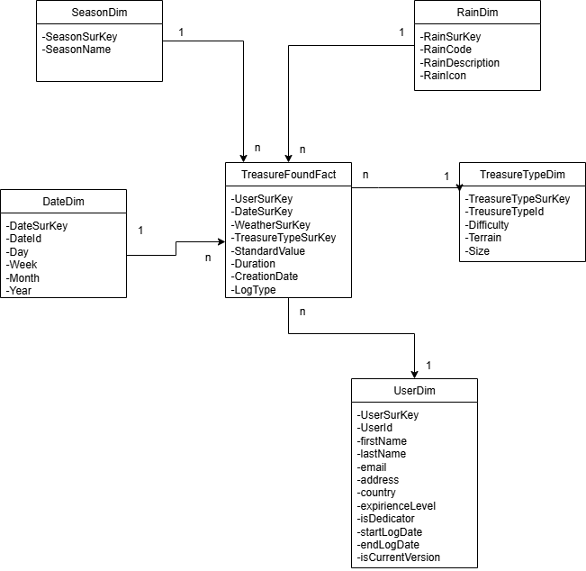

# Bronanalyse

## TreasureFoundFact

| Column | Source | SCD Type |
|--------|--------|----------|
| UserSurKey | UserDim.UserSurKey | n.v.t. (fact table) |
| DateSurKey | DateDim.DateSurKey | n.v.t. (fact table) |
| SeasonSurKey | SeasonDim.SeasonSurKey (via LogDate + Treasure.City.Country) | n.v.t. (fact table) |
| RainSurKey | RainDim.RainSurKey (via Weather API op basis van LogDate + Treasure.City coördinaten) | n.v.t. (fact table) |
| TreasureTypeSurKey | TreasureTypeDim.TreasureTypeSurKey | n.v.t. (fact table) |
| StandardValue | Berekend veld (gebaseerd op Difficulty + Terrain) | n.v.t. (fact table) |
| Duration | Berekend: LogDate - SessionStart | n.v.t. (fact table) |
| CreationDate | Log.LogDate (timestamp van de log) | n.v.t. (fact table) |
| LogType | Log.LogType (0=General Message, 1=Not Found, 2=Found) | n.v.t. (fact table) |

## DateDim

| Column | Source | SCD Type |
|--------|--------|----------|
| DateSurKey | Gegenereerd (datum in YYYYMMDD formaat) | 1 |
| DateId | Gegenereerd (volgnummer) | 1 |
| Day | Afgeleid uit Log.LogDate | 1 |
| Week | Afgeleid uit Log.LogDate | 1 |
| Month | Afgeleid uit Log.LogDate | 1 |
| Year | Afgeleid uit Log.LogDate | 1 |

## SeasonDim

| Column | Source | SCD Type |
|--------|--------|----------|
| SeasonSurKey | Gegenereerd (volgnummer) | 1 |
| SeasonName | Afgeleid uit Log.LogDate + Treasure.City.Country (meteorologisch seizoen) | 1 |

## RainDim

| Column | Source | SCD Type |
|--------|--------|----------|
| RainSurKey | Gegenereerd (volgnummer) | 1 |
| RainCode | Weather API (http://openweathermap.org/weather-conditions) op basis van LogDate + Treasure.City coördinaten | 1 |
| RainDescription | Weather API - beschrijving van weercode | 1 |
| RainIcon | Weather API - icon code | 1 |

**Opmerking RainDim:** Deze dimensie bevat maximaal 3 rijen:
- 1 rij voor alle weertypes MET regen (weercode 200-699)
- 1 rij voor alle weertypes ZONDER regen
- 1 rij voor "Regen situatie onbekend"

## TreasureTypeDim

| Column | Source | SCD Type |
|--------|--------|----------|
| TreasureTypeSurKey | Gegenereerd (volgnummer) | 1 |
| TreasureTypeId | Treasure.TreasureId (natuurlijke sleutel) | 1 |
| Difficulty | Treasure.Difficulty (0-4) | 1 |
| Terrain | Treasure.Terrain (0-4) | 1 |
| Size | COUNT(Stage) per Treasure (aantal stages binnen een treasure) | 1 |

## UserDim

## UserDim

| Column | Source | SCD Type |
|--------|--------|---|
| UserSurKey | Gegenereerd (volgnummer - surrogate key, wijzigt per versie) | 2 |
| UserId | User.UserId (natuurlijke sleutel, blijft constant over versies) | 2 |
| firstName | User.FirstName | 1 |
| lastName | User.LastName | 1 |
| email | User.Email | 1 |
| address | User.Street + User.Number | 1 |
| country | User.City.Country | 2 |
| experienceLevel | Berekend obv COUNT(Log WHERE LogType=2): Starter (0), Amateur (<4), Professional (4-10), Pirate (>10) | 2 |
| isDedicator | Berekend: TRUE als User is admin van minimum 1 Treasure, anders FALSE | 2 |
| startLogDate | Gegenereerd: begindatum versie (datum wanneer deze versie actief werd) | 2 |
| endLogDate | Gegenereerd: einddatum versie (NULL voor huidige versie) | 2 |
| isCurrentVersion | Gegenereerd: TRUE voor huidige versie, FALSE voor historische versies | 2 |

